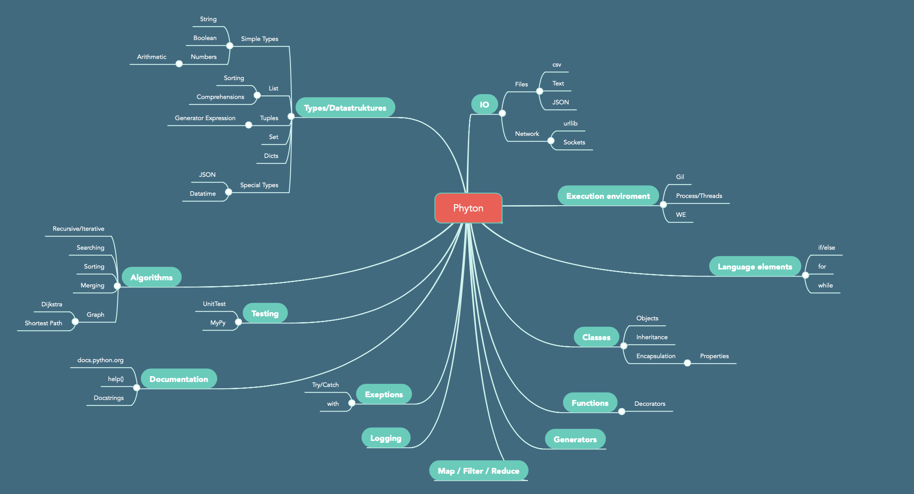

# Lesson 1: Introduction to the Python elective

<a href="https://python-elective-1-spring-2019.github.io/">index</a> | 
<a href="../../../Lesson-02-Introduction-to-Python-and-Python-Strings/blob/master/README.md">next</a>

> Agenda 08-02-2019

## Topics today
Today will be an "overview" and "installation" day. We need to be on the same level before we start. You will furthermore get an introduction to the unix filesystem and commandline and you will have exercises in controling your computer through the commandline. 

## Required reading
* [Learning Objectives](/other_materials/learning_objectives.md)
* [Installations](/other_materials/installation.md)
* [Unix Commands](/other_materials/unix_commands.md)
* [Exercise: Unix Commands](/exercises/UNIX_commands.md)

### Supplementary reading
* [Getting Started with Python in VS Code](https://code.visualstudio.com/docs/python/python-tutorial)
* [Git Tutorial](/other_materials/git-tutorial.md)

## Exercises
* [Unix Commands](/exercises/UNIX_commands.md)

## Installation
* [Instalations for this semester](/other_materials/installation.md)
* Special for Mac OS: [Create an alias python/python3](/other_materials/mac_alias.md)
 

## How will our development enviroment look like this semester?
* Windows
* Mac
* Linux

> [Code example](code_from_today/hello.py)

## Course overview

## Teachings / Exercises
* [Teaching Plan](https://python-elective-1-spring-2019.github.io/)  
---
* Techings 6 lektions a week for 15 weeks.  
    * Teachings - Exercises - Recap  
---
* Homework (9 hours per week):
    * Reading: Required reading from this time. 
    * Look at required reading for next time
    * Home Exercises  

## The UNIX File system and Terminal Commands
* [Unix Commands](/other_materials/unix_commands.md)
* [Exercise: Unix Commands](/exercises/UNIX_commands.md)
---
* If you want to chalenge yourself this semester:
    * [Virtualbox](https://www.virtualbox.org/wiki/Downloads)
    * [Ubuntu](https://www.ubuntu.com/)
---

## Exam & Mandatory Assignments
* 2 Mandatory assignments
    * 1 in the middle
    * 1 in the end 
* Exam
    * Not settled yet, either
        * 24 hours written assignment
        * 30 minutes oral exam
    <!--* 24 hour exam
        * You get 10 randomly chosen exam questions/assignments
        * You are evaluated on 
          * "Correct code"
          * Code quallity
            * Test cases
            * Documentation
            * Finnish -->

## What is Python used for?
* Youtube
* Google
* Spotify
* Reddit
---
* Machine learning
* Linkedin / Jobindex

## Why did you choose this elective? 

### What can you expect

## Required and Supplementary readings
* [Python docs](https://docs.python.org/3.7/index.html)
* [Real Python](https://realpython.com/)

<a href="https://python-elective-1-spring-2019.github.io/">index</a> | 
<a href="../../../Lesson-02-Introduction-to-Python-and-Python-Strings/blob/master/README.md">next</a>

